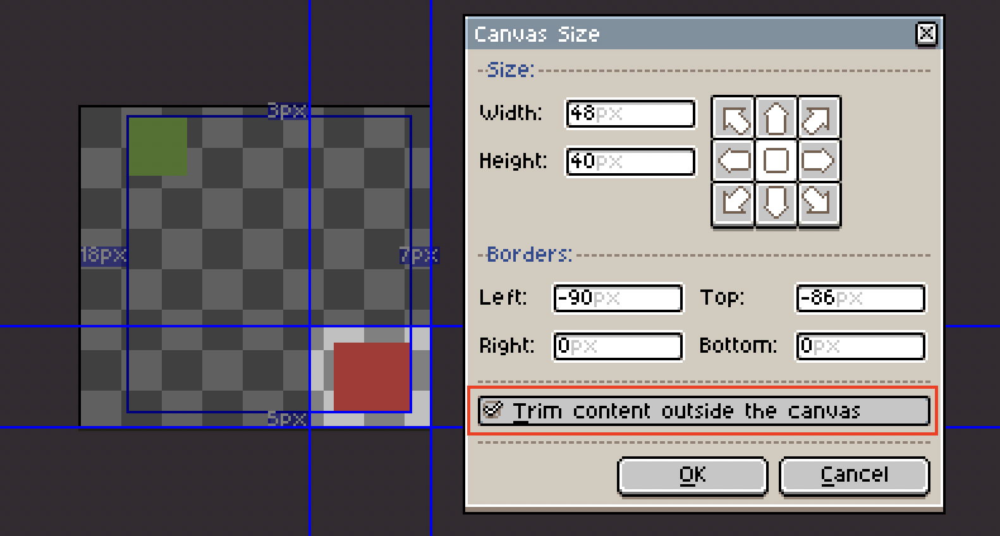
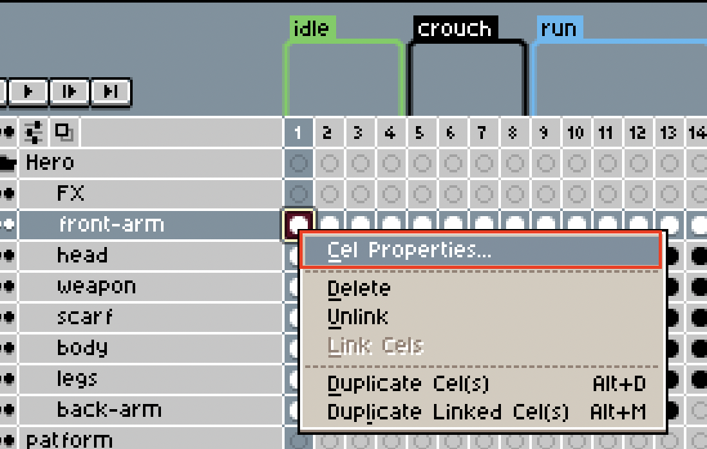
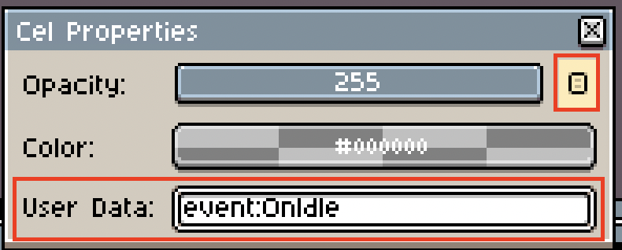
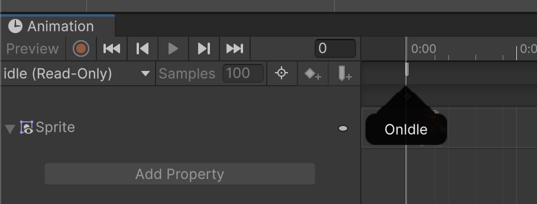
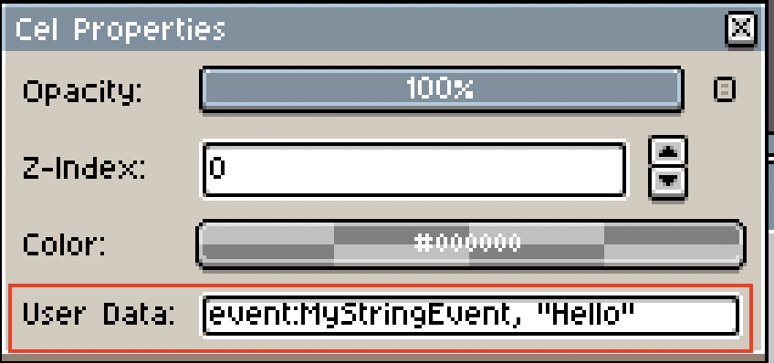
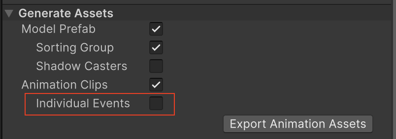
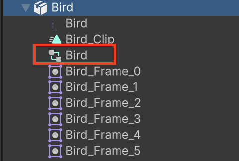
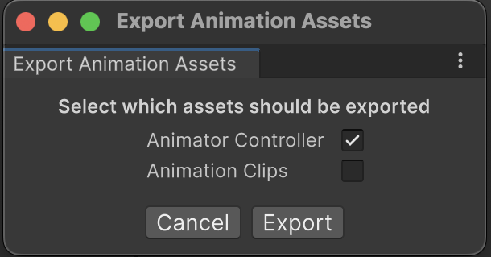
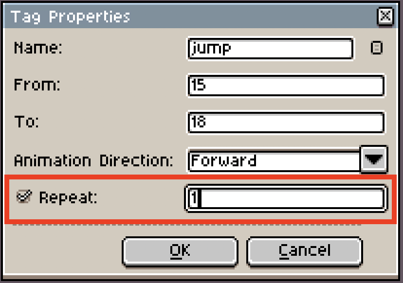

# Frequently asked questions

## How are the layers sorted in Unity?
When an Aseprite file is imported using the **Import Mode: Individual**, every layer from the source file becomes a GameObject inside the generated model prefab. If the layer is a normal layer (and not a group layer), it has a SpriteRenderer component added to it. To make sure each SpriteRenderer renders in the same order as inside Aseprite, Unity automatically assigns a value to the **Order in Layer** field on the SpriteRenderer component. This value is a combination of two variables, the order of the layer inside Aseprite, where the bottom layer has the value of 0, and the top layer has the value of `Number of layers`, e.g., if the source file contains five layers, the top layer will have the value of 5. The second value is the z-index, which can be set per cell in Aseprite. The final formula to calculate the **Order in Layer** value is: `Layer count from the bottom + Z-Index of the current cell`.

Apart from the Order in Layer value, Unity also adds a [Sorting Group component](https://docs.unity3d.com/Manual/class-SortingGroup.html) onto the root GameObject of the model prefab, to make sure that every SpriteRenderer within the prefab is sorted together.

For more information about general 2D sorting in Unity, see [the 2D Sorting page](https://docs.unity3d.com/Manual/2DSorting.html) in the Unity manual.

## Which actions cause Sprite data to be overwritten?
The Aseprite Importer will overwrite custom Sprite data authored in the Sprite Editor when the following actions are performed:
* Updated any of the following importer settings:
  * Pivot alignment
  * Pivot space
  * Custom pivot point
  * Sprite padding
* Changed the cell's size in Aseprite.
* Packing texture's size has changed.
* Removed or renamed a layer.
* Import mode is set to TileSet.

### Enable UUID for layers
By default, the Aseprite Importer identifies the layers (and the Sprites) by the name and the path of a layer. In Aseprite `v1.3.14-beta1`, a unique identifier for layers was introduced. If switched on, the Sprite data is kept even if the layer name in Aseprite is changed.

To turn the unique identifiers on, open Aseprite, go to **Sprite > Properties...** and check the **Create UUID for layers**-checkbox. Note that this has to be done for every Aseprite file.


## How to combine multiple sprite sheets into one?
You can make use of Sprite Atlases to combine multiple sprite sheets into a single texture. Read more about Sprite Atlas [here](https://docs.unity3d.com/2021.3/Documentation/Manual/class-SpriteAtlas.html). Combining multiple sprite sheets into one is a good way to reduce the draw calls in a scene.

## Why is my trimmed Aseprite file not trimmed in Unity?
When modifying the [canvas size](https://www.aseprite.org/docs/canvas/#canvas-size), make sure the **Trim content outside the canvas** checkbox is checked. This way, the stored texture will be cropped to the specified size.



## How to add events to Animation Clips?
[Animation Events](https://docs.unity3d.com/Manual/script-AnimationWindowEvent.html) can be generated by adding user data to Cells inside Aseprite.

Follow these steps to add an Animation Event to a frame:

* In Aseprite, select any cel in the frame you want to add an event to.
* Right-click on the cel and select **Cel Properties**.



* Press the **User Data**-button to the left of the **Opacity** slider to bring up the **User Data**-field.



* Enter the event name in the following format: **event:EventName**. E.g. **event:OnIdle**.

* Save the file and switch over to Unity.

* Open the Animation Window and inspect the Animation Clip. You can see that the event has been added to the frame.



To receive the event, place the following script on the same GameObject as the Animator is located on:
```CSharp
using UnityEngine;

public class MyEventReceiver : MonoBehaviour
{
    // In our example, we created an event called "OnIdle".
    // This should be changed to the event name you specified in Aseprite.
    private void OnIdle()
    {
        Debug.Log("OnIdle was called.");
    }
}
```

### Add an argument to an event

You can also add one argument to the event. We support the following data types:
* String
* Integer
* Float

To add an argument to an event, add a comma (,) after the event name and then fill in the argument. E.g.
* **event:MyIntEvent, 123**
* **event:MyFloatEvent, 1.234f**
* **event:MyStringEvent, "Hello"**

**Note:** If the Individual Events toggle is unchecked in the Generate Assets settings, arguments will not be available in the event. The only argument used by the general purpose event (OnAnimationEvent) is a string containing the event name from the User Data in Aseprite.



To receive the event with a parameter, place the following script on the same GameObject as the Animator is located on:
```CSharp
using UnityEngine;

public class MyEventReceiver : MonoBehaviour
{
    // In our example, we created an event called "MyEventReceiver" with a string parameter.
    // This should be changed to the event name and parameter type you specified in Aseprite.
    private void MyStringEvent(string data)
    {
        Debug.Log($"MyStringEvent was called with the data: {data}");
    }
}
```

### Single event receiver for all events

There are times when you prefer to receive all animation events from an Animator in one method. To do this, begin by unchecking the Individual Events toggle in the Aseprite Importer inspector.



By unchecking the Individual Events toggle and pressing Apply, the Aseprite Importer will update the AnimationClips to use the following event string "OnAnimationEvent" for all events.

To receive the events, place the following script on the same GameObject as the Animator is located on:

```CSharp
using UnityEngine;

public class MyEventReceiver : MonoBehaviour
{
    private void OnAnimationEvent(string eventName)
    {
        Debug.Log($"{eventName} was called.");
    }
}
```

**Note:** If the Individual Events toggle is unchecked in the Generate Assets settings, arguments will not be available in the event. The only argument used by the general purpose event (OnAnimationEvent) is a string containing the event name from the User Data in Aseprite.

## How to make changes to an Animator Controller?
The Aseprite Importer generates an Animator Controller if the Aseprite file contains more than one frame, and the **Animation Clip** checkbox is checked in the importer. This Animator Controller is Read-Only, meaning that it cannot be changed.



The Animator Controller is Read-Only.

If you like to have an Animator Controller which you can change, follow these steps:

* Select an Aseprite file in Unity.
* Press the **Export Animation Assets**-button.
* In the popup, make sure the **Animator Controller** checkbox is checked. Leave the **Animation Clips** checkbox unchecked if you do not wish to edit any of the clips.
* Press **Export** and select a folder to place the Asset(s) into.



An Animator Controller should now be located in the selected folder. If the Animation Clip checkbox was left unchecked, all the states within the Animator Controller are linked back to the Aseprite file, meaning that the clips will stay up to date with any changes made in Aseprite.

Do note that if you add a new [tag](https://www.aseprite.org/docs/tags/) in Aseprite, you need to add the resulting Animation Clip to the exported Animator Controller, as this will not happen automatically.

## How to inject custom assets on import?
The Aseprite Importer comes with an event, OnPostAsepriteImport, which is fired at the end of the import process. This event can be used to inject or change the generated assets when importing an Aseprite file.

```CSharp
using UnityEditor;
using UnityEditor.U2D.Aseprite;
using UnityEngine;

public class GameObjectInjector : AssetPostprocessor
{
    void OnPreprocessAsset()
    {
        if (assetImporter is AsepriteImporter aseImporter)
            aseImporter.OnPostAsepriteImport += OnPostAsepriteImport;
    }

    static void OnPostAsepriteImport(AsepriteImporter.ImportEventArgs args)
    {
        var myGo = new GameObject("MyGameObject");
        args.context.AddObjectToAsset(myGo.name, myGo);
    }
}
```

## How to disable looping on Animation Clips?
By default, Animation Clips generated from Aseprite [Tags](https://www.aseprite.org/docs/tags/) will automatically loop. To disable looping, open Aseprite and bring up the Tag Property window of the Tag you wish to turn non-looping. In the Repeat field, change the value from ∞ to 1 (Aseprite Importer only supports looping and non-looping. Any value greater than 1 will still result in only a single playback).



Save your changes in Aseprite and switch over to Unity. The Aseprite file will automatically be reimported with the Animation Clip updated with non-looping set.
